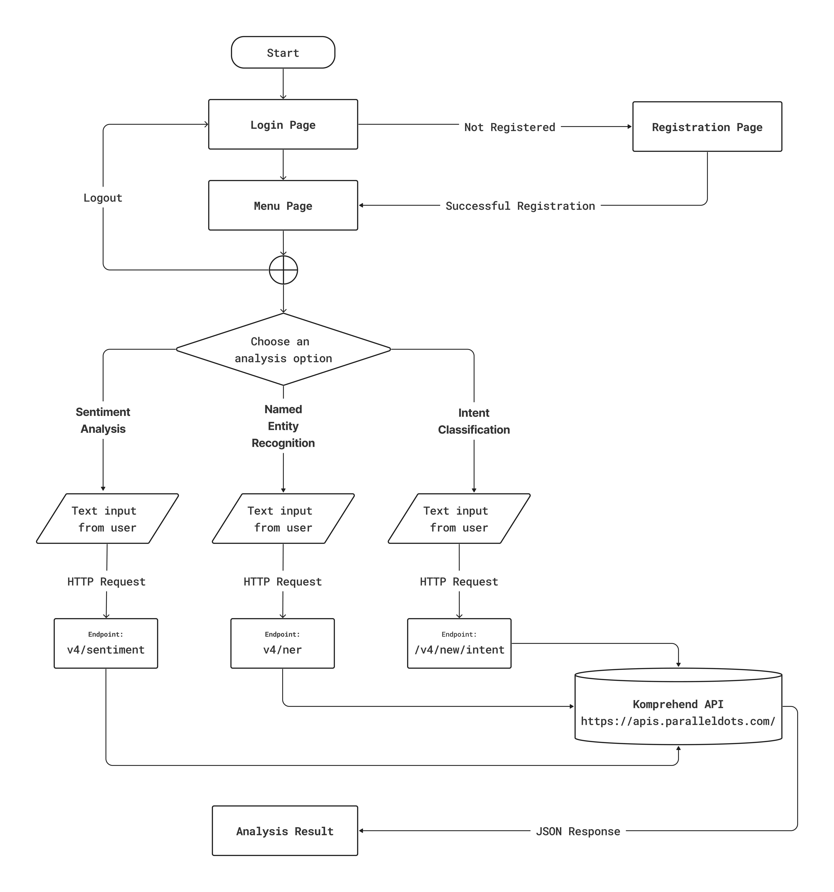
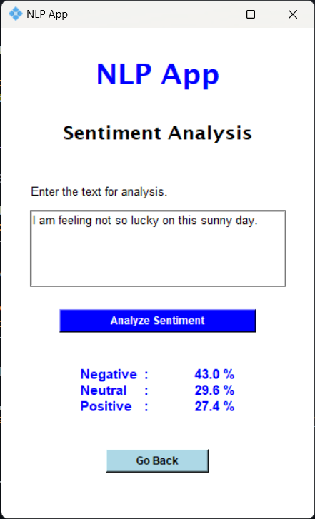
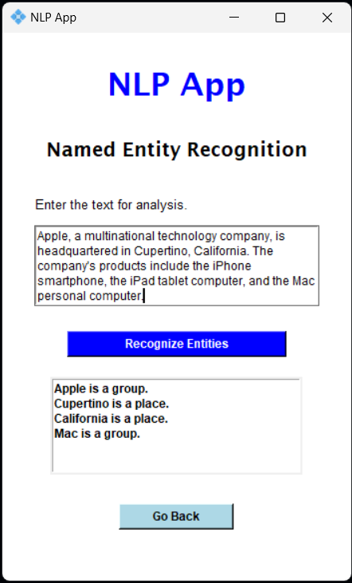
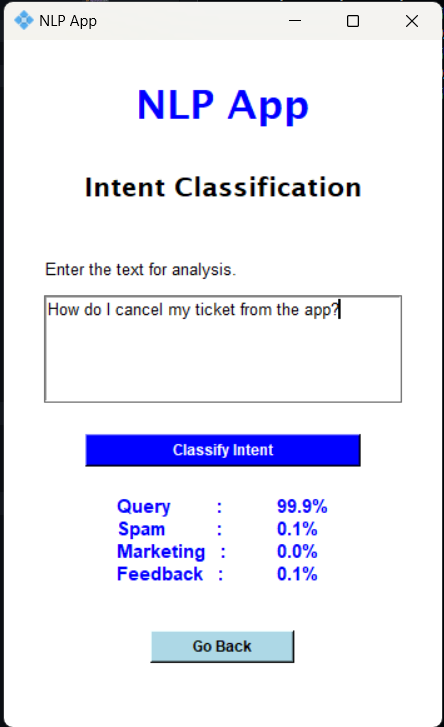

  <h1>NLP Text Analyzer</h1> 
  
An API-based NLP application created using <b>tkinter</b> and <b>OOP</b> in <b>Python</b>.

  
 

  <h2>Workflow</h2>
  

 

  <h2>Screenshots</h2>
  
  
  

 

#### Link for API
> [Komprehend API](https://komprehend.io/api-wrappers)
